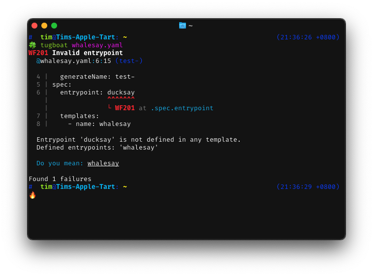

# Tugboat

> The tugboat guides the ship to flight, from harbor's hold to ocean's light.

A linter to streamline your [Argo Workflows] with precision and confidence.

Tugboat helps you identify and resolve potential issues before they become runtime problems, saving you time and ensuring smoother deployments.

[Argo Workflows]: https://argoproj.github.io/workflows/

Argo Workflows empower developers to orchestrate complex containerized processes, but designing error-free manifests can be challenging.

Tugboat provides a range of features tailored to the needs of Argo Workflow users:

- ⚙️ Syntax Validation
   - Catch common mistakes that might cause workflows to fail at runtime.

- 🔍 Error Detection
   - Highlight undefined, unused, or misconfigured references within manifests.

- 📘 Argo Workflow Support
   - Designed to align with Argo Workflow specifications, Tugboat ensures compatibility with supported versions of Argo.

- 🚀 Lightweight and Fast
   - Tugboat integrates seamlessly into your development workflow, offering quick feedback without compromising your pace.

- 📊 Actionable Insights
   - Clear, actionable error messages and warnings to help you fix issues efficiently.

## Documentation

[📗 Link to the documentation 📗](https://argo-tugboat.readthedocs.io/en/stable/)
