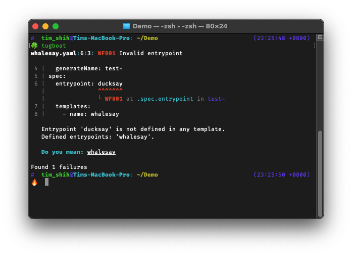

> [!CAUTION]
> This project is still in early development stage. Anything can change at any time.

# Tugboat

> The tugboat guides the ship to flight, from harbor's hold to ocean's light.

A linter to streamline your [Argo Workflows] with precision and confidence.

[Argo Workflows]: https://argoproj.github.io/workflows/
