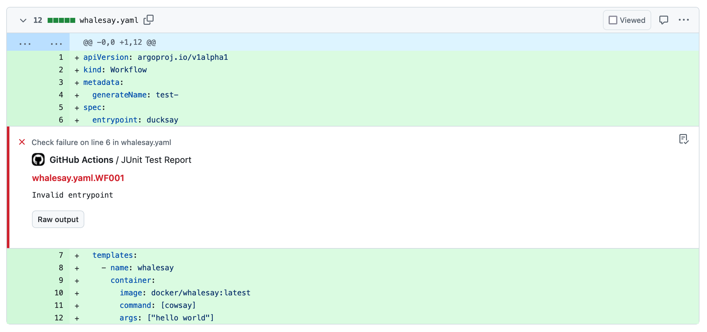
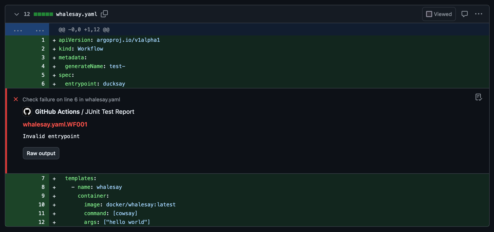

JUnit XML Report
================

Tugboat is able to output a JUnit XML report of the linting results.
This can be useful for integrating Tugboat into your CI/CD pipeline.

Usage
-----

To generate a JUnit XML report, use the ``--output-format=junit`` option:

.. code-block:: bash

    tugboat --output-format=junit --output-file=report.xml

GitHub Actions
--------------

Tugboat does not have a built-in support for GitHub Actions, but you can get it from PyPI and use it in your workflow.

Furthermore, you can combine the JUnit XML report with the `JUnit Report Action`_ to report the results as pull request check.

Here is an example workflow that lints the manifests and reports the results as a pull request check:

.. code-block:: yaml

   name: lint

   on:
     pull_request:

   jobs:
     lint:
       name: Lint the manifests
       runs-on: ubuntu-latest
       permissions:
         contents: read
         checks: write
       steps:
         - name: Setup Python
           uses: actions/setup-python@v5
           with:
             python-version: "3.12"
         - name: Get tugboat
           run: pip install argo-tugboat
         - name: Checkout Code
           uses: actions/checkout@v4
         - name: Lint the manifests
           run: tugboat --output-format=junit --output-file=${{ runner.temp }}/tugboat-report.xml
         - name: Publish Test Report
           uses: mikepenz/action-junit-report@v5
           if: success() || failure() # always run even if the previous step fails
           with:
             report_paths: ${{ runner.temp }}/tugboat-report.xml

It could produce a check like this:

.. _JUnit Report Action: https://github.com/marketplace/actions/junit-report-action
